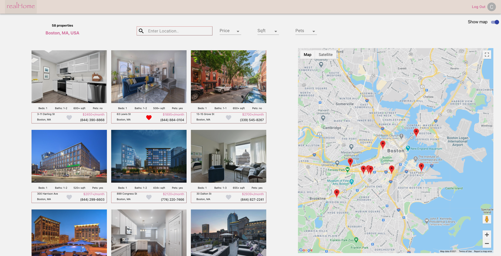

# realHome App (React / Rails API Application)

* Here is the Frontend repo of this app. Link to [Backend Repo](https://github.com/chinguyen21/realHouse-backend)

A tracker calories application inspired by my personal need. It was made with React for frontend and Rails API for backend

## TOOL

1. React Hook
2. Ruby
3. Rails API
4. Javascript
5. Google Map Javascript API
6. Google Place Autocomplete API
7. PostgreSQL
8. Bcrypt + JSON Token
9. Material UI
10. CSS
  

## INTRUCTIONS

1. Clone this repository
2. Using the terminal navigate to the root directory
3. Run "Bundle Install", then "rails server" from backend directory
4. Run "npm install", then "npm start" from frontend directory
5. I hide my API key in my development environment. If you want to seed data, please get a new API key from this [site](https://rapidapi.com/apidojo/api/realtor/details) to able to create properties.

## FEATURES

* Without sign up or log in, users still can see all the updated apartments with very detailed information
* When sign up or log in successfully, users can save the properties and view them later. User also can remove the saved properties.
* Users can search locaton where they want to see the listing apartments with suggesting nearby location from Google Place Autocomplete API.
* Users can see detailed information of each property like the price per month, the number of bedrooms, bathrooms, the sqrt, the built-year, all features of that house and nearby schools of that property.
* Users can search properties by price, by sqft, and by pet allowing
* Users can edit their account information
* User can contact the property owner by the given phone number or send them a message through the built-in function
* If a user is the owner of a property, they can see all the messages people leave to them when they log in

## PREVIEW

### Built by Chi Nguyen

